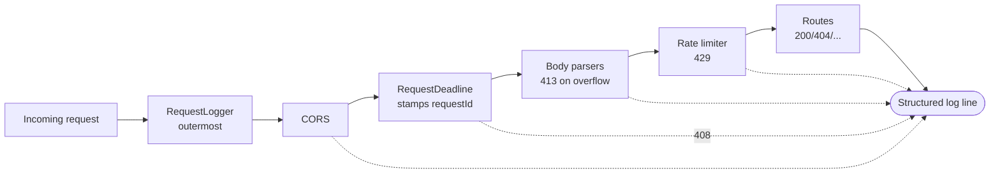

feat(observability): structured HTTP request logging middleware

## Summary

Fixes #665

Every completed HTTP request emits exactly one structured JSON log line carrying `method`, `path`, `statusCode`, `durationMs`, `requestId`, `clientIp`, `aborted`, and `outcome`. The middleware is mounted as the **outermost** layer in `app.js`, so a single line covers every terminal outcome — CORS rejections, body-parser `413`s, request-deadline `408`s, rate-limit `429`s, and route handlers — rather than only the routes a handler chose to log.

Output flows through the existing `console.*` → `src/lib/logging.js` pipeline, so secret redaction and `LOG_LEVEL` filtering apply without a parallel format.

This revision supersedes the original #967 head: the branch was 192 commits behind `master` and `CONFLICTING`. It has been merged up to `master` and the feature re-integrated against current `master`, which already ships `src/lib/requestDeadline.js`.

## Key Changes

### New middleware — `src/lib/requestLogger.js`
- Emits one line per request through the existing structured JSON pipeline.
- Level follows the outcome: `info` for 2xx/3xx, `warn` for 4xx and client aborts, `error` for 5xx.
- Mounted first in `app.js`; it only attaches `finish`/`close` listeners and calls `next()`, so it **cannot** change any status code, header, or response body.

### Integration with the request deadline (not a fork of it)
`master` already ships `src/lib/requestDeadline.js`, which owns the request-id vocabulary and the probe-path exemption list. The original PR re-implemented both, which would have let the two middlewares drift:

| Concern | Resolution |
|---|---|
| Correlation id | `requestDeadline.resolveRequestId(req)` — the log line, the `X-Request-Id` header, and the `408` payload all carry the same id |
| Probe skip list | `requestDeadline.resolveExemptPaths()`, read per request, so `REQUEST_DEADLINE_EXEMPT_PATHS` silences both middlewares at once (new `resolveExemptPaths` export added to `requestDeadline`) |
| Probe predicate | `requestDeadline.isExemptPath(path, exemptPaths)` — a **single shared** matcher, so the deadline and the log cannot disagree about what counts as a probe route. `/docs` is subtree-aware (Swagger pulls css/js from the same router) |
| Path normalization | one rule for both the configured set and incoming requests (`normalizeExemptPath`): leading slash, lower-case, strip trailing slashes. Both halves matter — without them `REQUEST_DEADLINE_EXEMPT_PATHS=/Internal/Ping` and `=/api/slow/` silently exempt nothing |

### Correctness bugs found and fixed during review
1. **Truncated downloads logged as clean completions.** Abort detection read `res.writableEnded`, which flips the instant the handler calls `res.end()` — before bytes reach the socket. A client disconnecting in that window produced `outcome: "completed", aborted: false` with a tiny `durationMs`. Now reads `res.writableFinished`.
2. **`/HEALTHCHECK` bypassed the probe skip list.** The deadline exempted it while the logger logged it; one character of variation per request was enough to flood logs from a health probe.
3. **A throwing log sink could crash the process.** `emit()` ran unguarded from a Node event emitter, outside Express's `try/catch`. `console.*` is globally replaceable (the logging wrapper, Sentry, test doubles), so an observability path could take down the server. Now wrapped in `try/catch`.
4. **Abort reported a phantom `statusCode: 200`.** Node initializes `res.statusCode` to 200 even when nothing was written, so an early disconnect was logged as a success. Now reports `0` when no response began.
5. **Masking ran before exemption matching.** An operator who configured `/api/preferences/telegram/123` as exempt would still see it logged, because the path was rewritten to `:redacted` first. Exemption is now decided on the unmasked path.
6. **Lower-casing the logged path broke `/api/alerts/:alertId` searchability.** Firestore document ids are mixed case and case-sensitive, so a lower-cased path would not match the id an operator saw in a 404 body. Matching and display are now separate concerns: the exemption set matches case-insensitively, the emitted path keeps its original case.
7. **`/docs/*` asset subtree was logged.** `/docs` is documented as a probe route, but exact set membership exempted none of `swagger-ui.css`, `swagger-ui-bundle.js`, `swagger-ui-standalone-preset.js`, or `swagger-initializer.js`.

### Privacy
- Query strings are stripped, so request parameters and secrets never reach the log.
- `/api/preferences/:channel/:chatId` is masked to `:redacted` — a personal destination, and the one parameterized route segment the centralized logger cannot catch (the attribute is named `path`, and bare numeric or `@g.us` values match no secret rule).
- `clientIp` is masked to `a.b.c.x` for IPv4 and reported as `ipv6-redacted` for IPv6.
- No request or response bodies are logged, and no headers.

### Documentation
- `docs/monitoring.md` — "Structured Request Logging" section: field table, level mapping, `requestId` correlation recipe, and what is deliberately not logged.
- `src/openapi/openapi.json` — `X-Request-Id` is declared as a reusable response-header component (`XRequestIdResponseHeader`) and referenced from all 8 operations documenting `x-request-id`, so generated clients can discover it. Prose on a request parameter cannot become a client property.
- `docs/environment-configuration.md` — `REQUEST_DEADLINE_EXEMPT_PATHS` now notes it also silences request logging.
- `AGENTS.md` — documents the invariants (shared id, single exemption vocabulary, `writableFinished`, exempt-before-mask, fail-open emit).
- `.env.example` — notes that `REQUEST_DEADLINE_EXEMPT_PATHS` also silences request logging; no new variable.

## Technical Implementation

The logger attaches listeners at position 0 and finalizes on whichever of `finish`/`close` arrives first, guarded by a `finalized` flag so a clean response never logs twice. On `close`, `finalize(!res.writableFinished)` distinguishes a client abort from a completed response.

## Testing

- `pnpm test` — **224 suites, 4,596 tests passed**
- `tests/unit/requestLogger.test.js` — level mapping, single-emission guard, abort vs completion, IPv4/IPv6 masking, path normalization, case preservation, sensitive-segment masking, exempt-path matching, fail-open emit, and four SSE classification cases. One drives a **real `http.ServerResponse`** through the actual `writeHead` handshake with no prior `setHeader` and no stubbed `getHeader` — the `node-mocks-http` double is more forgiving than the real runtime here and would have hidden the defect. All four SSE tests were mutation-checked: reverting the fix fails them.
- `tests/unit/security-workflows.test.js` — asserts the gitleaks fixture exception stays value-scoped and that no global allowlist entry narrows the scan by path.
- `tests/integration/request-logger.test.js` — supertest coverage for parser rejections, `x-request-id` header reuse, `408` payload/log id agreement, and probe-path silence.
- `tests/unit/handlers-request-id.test.js` and `tests/unit/alert-webhook-request-id.test.js` — handlers reuse the middleware-resolved id.
- Each of the seven bug fixes is covered by a regression test verified to fail when the fix is reverted.
- Local smoke test (`pnpm run start-dev`, port 3199): `GET /api/selftest` → `warn` line with `statusCode=401`, `requestId=smoke-req-001` echoed from the inbound header, `durationMs` present; `GET /api/alerts` → `401` logged at `warn`; `GET /api/does-not-exist` → `404` logged at `warn`; `GET /healthcheck` → `200` returned and correctly **not** logged.
- Live preview verified: `https://openclaw.tail5e4271.ts.net/cabros-bot-pr-967/healthcheck` and `/openapi.json` return `200`; a custom `x-request-id` header is echoed on both the response header and the error payload.

### Idempotency replay correlation
A replayed body is re-correlated: request headers are not part of the idempotency fingerprint, so a retry carrying a new `x-request-id` is a valid replay. `sendCachedResponse` rewrites `requestId` to the replaying request's id so the body, the `X-Request-Id` header, and the access log all agree. Without it, one response would advertise a correlation id that appears nowhere in the logs for the replay.

## Follow-up review round (4 findings)

The previous head handed off with four findings that Codex had confirmed as valid
and that were left unfixed. Each is addressed here; none was waved through.

### 1. SSE abort suppression keyed on the path, not the stream

`treatAsAborted` was `aborted && !isSsePath(rawPath)`. Asking the path "does this
look like an event stream?" silently merged two different events: a stream the admin
console closed on purpose, and a client that vanished **before** the stream opened —
while async Firebase token verification was pending, or while a 401/403/503 body was
still flushing. The second is a genuine client failure and was being recorded as an
info-level completion.

`trackEventStream(res)` now asks the response what it became, rather than asking the
path what it looks like. Keying on the path alone merged two different events: a stream
the admin console closed on purpose, and a client that vanished **before** the stream
opened — while async Firebase token verification was pending, or while a 401/403/503
body was still flushing. The second is a genuine client failure and was being recorded
as an info-level completion.

**The content type has to be captured at handshake time.** A first attempt read
`res.getHeader('Content-Type')` inside the `close` handler. That is wrong: `writeHead()`
serializes headers into its own buffer and leaves the live header store empty, so the
read returns `undefined` unless some *earlier* `setHeader` happened to run — and today
that earlier call is `requestDeadline` setting `X-Request-Id`. The answer would then
depend on an unrelated middleware. Verified against real Node: after
`writeHead(200, {'Content-Type':'text/event-stream'})`, `getHeader` returns
`undefined` when nothing set a header first. Two independent triggers reach that
state — exempting the route via `REQUEST_DEADLINE_EXEMPT_PATHS` (a documented option
an operator would plausibly use for a long-lived stream), and `app.disable('x-powered-by')`
/ `helmet({hidePoweredBy})`. Either one turned every routine admin-console teardown
into a warn-level abort.

The middleware now wraps `res.writeHead` — the same technique `requestDeadline` already
uses — and records establishment from the headers actually being committed.

### 2. Seven self-test error responses carried `headers` beside `$ref`

OpenAPI 3.1 ignores siblings on a Reference Object, so those `headers` blocks were
dead weight that happened to agree with the referenced components. An earlier round
fixed the 8 success responses; the 7 error responses were missed because the fix was
scoped to the paths already under inspection rather than sweeping the contract. A
whole-file AST scan now reports zero `$ref`-plus-`headers` siblings; the `$ref` values
are preserved and the headers live solely in the referenced components.

### 3. The `X-Request-Id` description overpromised

The component claimed the id "is also returned as `requestId` in JSON response bodies".
`src/lib/auth.js` returns `{ error: '…' }` for a missing or invalid key with no
`requestId` at all, and the deadline middleware only sets the header. Because the
description sits on a reusable component, the claim applied to every response
referencing it. Narrowed to the header guarantee, with the body echo described as
something handlers *may* do. Adding `requestId` uniformly would be better for
correlation, but that changes response bodies on auth and rate-limit paths — a wider
behavioural change than an observability PR should carry on its own.

### 4. The gitleaks exception was scoped to a file, not a value

The global `[allowlist]` listed both `paths` (matching
`tests/integration/generic-message-webhook.test.js`) and `stopwords`. Global allowlist
criteria combine permissively, so `paths` alone suppressed **every** secret finding in
that file — a real credential committed there would have passed the scan.

Verified empirically against gitleaks **8.24.3**, the version `gitleaks-action@v3` pins,
with a `xoxb-…` Slack token planted in that same file:

| Config | Slack token reported | Historical fixture findings |
|---|---|---|
| `paths` + `stopwords` (previous) | **no** | suppressed |
| `stopwords` only (this revision) | **yes** | suppressed |

The action scans full history (`fetch-depth: 0`), and commit `c5640c8d` still contains
the fixture value, so the `stopwords` entry is load-bearing and cannot simply be
deleted. Dropping `paths` keeps it effective while restoring detection. A regression
test in `tests/unit/security-workflows.test.js` asserts the global allowlist never
declares a `paths` key.

## Known limitation

The issue's "< 1ms overhead" criterion is not asserted by an automated test. The middleware performs one `Date.now()` pair, two `String.replace` calls, one `Set` lookup, and one `console.info` per request — no per-request allocation beyond the listener closures, and no synchronous I/O — but no benchmark pins that claim.

## References

- Issue: https://github.com/francovp/cabros-bot/issues/665
- Related: #608 (overlapping — closed by this issue), #581, #592